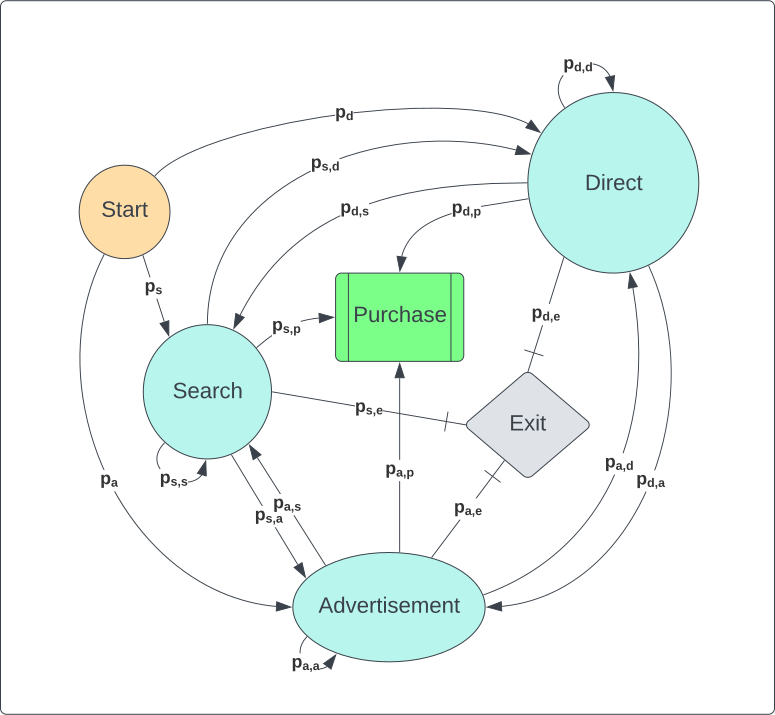
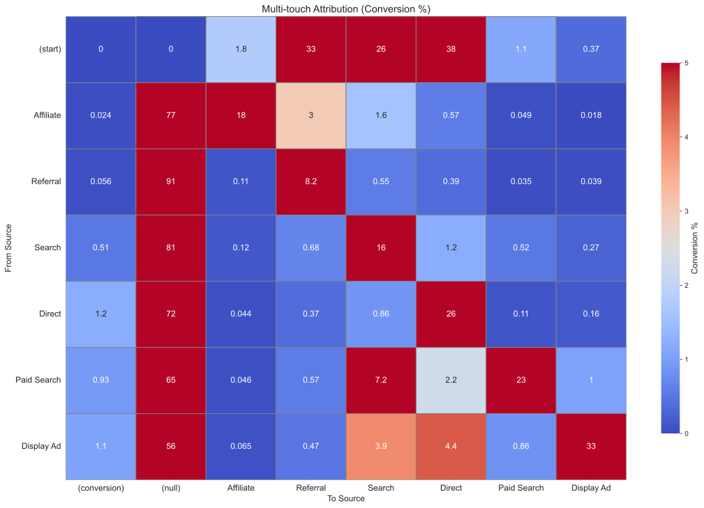

# Customer Journey Analysis: Evaluating Traffic Sources & Conversion Paths
Understanding how customers navigate the Google Merchandise Store is critical for optimizing marketing strategies. This analysis leverages Markov Chain Attribution to assess the impact of different traffic sources—such as direct visits, paid search, and display ads—on conversions. By modeling customer paths, we identify which channels contribute most to revenue and where marketing resources should be allocated for maximum return on investment.

    

The above displayed is a Markov Chain diagram that maps out the visitors traffic source sequences — similar to an amusement park map that shows all the attractions and the paths between them. But instead of just showing the routes, this map also displays the proportion of visitors moving from one point to another, giving insight into how users navigate toward a final destination (conversion). In evaluating the proportions, this helps to uncover how different traffic sources contribute to conversions, providing actionable insights into customer behavior.

**Key Insights**

1. Paid search and organic search dominate high-converting paths.
2. Direct Traffic shows strong late-stage influence and initial engagement.
3. Referrals contribute to early awareness but require retargeting to drive conversions.
4. Multi-touch attribution reveals that most conversions involve direct, display ads, and paid search, potential improvement on revenue and conversion by leading traffic to those sources with cross-channel strategies.

**Navigation of Analysis**

For transparency and reproducibility, this project includes the following resources:

- 'Data Extraction.ipynb': Extracts data of the Google merchaandise store [link](https://bigquery.cloud.google.com/table/bigquery-public-data:google_analytics_sample.ga_sessions_20170801) on Google Cloud using SQL queries and Python, cleaned datasets stored in 'agg_data.zip'.
- 'Multi-touch Attritbution.ipynb': Analysis on customers' (visitors') journey on the store website.
- 'Source Performance over Time.ipynb':  Evaluates traffic source performance and forecasts revenue trends.
- 'agg_data.zip': Contains all extracted datasets from Data Extraction.ipynb.

## Main Results
### Markov Chain Attribution Model
The following is a heatmap of the transition matrix of the percentage of visits from sources to sources of the starting source, which also includes:

- 'start' the starting point when the visitor first assess the website since August 2016.
- 'null' as the end point of most recent visits before August 2017.
- 'conversion' is when the visitor converted and made a purchase on the website.

For example, from 'start' to 'Affiliate', there is a 1.8\% of all visits starting at 'start' that ends at 'Affiliate'.

    

The main observations are:

- The three main entry source of the website is 'Direct' (38\%), 'Referral' (26\%), and 'Search' (33\%), which most visitors were introduced to the website from those sources. The other sources have less than 2\%. 
- Most purchases and conversiosn occurred through 'Direct' (1.2\%), 'Display Ad' (1.1\%), and 'Paid Search' (0.93\%).
- The sources with the highest 'null' percentage are 'Referral', 'Search', and 'Affiliate', implying these sources are more unlikely to keep visitors and customers to return to the website.
- For the source to source interactions, the path to the same sources has second highest percentage right under 'null'. 'Paid Search' and 'Display Ad' has a higher percentage (2.2\% and 4.4\%) of visits going to 'Direct'; 'Paid Search' has the highest percentage (1\%) going to 'Display Ad', and 'Display Ad' has a similar percentage (0.86\%) going to 'Paid Search'.

## Recommendations
- Most visits and revenue were generated from organic search and direct assess, suggesting that most purchases were likely made by returning visitors since the visitors must have known the website. Therefore reallocate budget on the sources that are more likely to keep visitors revisiting, being paid search and displayed advertisements, improving and investing more on the quality and quantity of these sources. Furthermore, paid search and displayed advertisements have higher conversion rate compared to the other sources. 
- On the other hand, drop affiliation if they make losses since affilate has the lowest conversion rate and high exit percentage compared to other sources. Even though referral also has a high exit percentage, it is one of the main source that introduce visitors to the websites that can be controlled by the company, so it is better to keep and maintain partnerships in referrals.

## Questions
- What's the commission rate for different partnerships? This determines whether affiliate is making losses throughout the year, and relocate budget to different partners that can make referrals to the target consumers based on return of ad spent (ROAS). Can the commission be renegotiated?
- Why does referral have a high exit percentage? Which referral site drives the most high-intent traffic? And can we exclude spam referrals?
